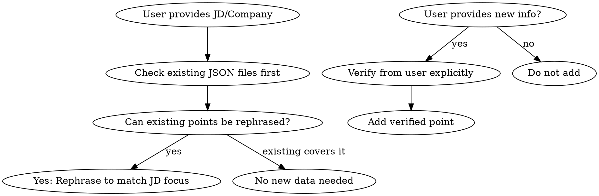

# Tailoring Resume to JD

## Overview

Update resume JSON files to match job description requirements using ONLY data that exists in the repo or is explicitly confirmed by the user. Never add fabricated, hypothesized, or fictional achievements, projects, or tech stacks.

This skill is designed for the [**resume-builder**](https://github.com/jangwanAnkit/resume-builder) project — a JSON-to-LaTeX resume generator template that users can fork and customize.

### CORE PRINCIPLE: Preserve Real-World Performance

**Your experience is your competitive advantage.** The resume-builder data contains real achievements with real metrics — these are NOT replaceable with generic slop.

**What MUST stay unchanged:**
- ✅ Real company names and roles
- ✅ Actual project names and descriptions
- ✅ Genuine metrics (percentages, numbers, timelines)
- ✅ Real technologies actually used
- ✅ Authentic challenges and outcomes
- ✅ Your specific accomplishments

**What CAN be rephrased:**
- Reorder bullet points to emphasize JD-relevant skills
- Rephrase existing bullets to lead with JD-important keywords
- Expand on relevant aspects of existing work
- Use stronger action verbs where appropriate

**What MUST NEVER happen:**
- ❌ Replace real projects with generic ones
- ❌ Add fake metrics or achievements
- ❌ Use generic bullet points like "collaborated with team"
- ❌ Overwrite real performance data with AI-generated slop

### AI Slop Detection & Humanization

If available in the system, use these skills to ensure quality:

1. **stop-slop** skill - Remove AI-generated patterns from rephrased content
   - GitHub: `hardikpandya/stop-slop`
   - Install: `npx skills add hardikpandya/stop-slop`

2. **humanizer** skill - Make content sound natural and human-written
   - GitHub: `humanizerai/agent-skills` (look for humanizer in available skills)
   - Alternative: `npx skills add openclaw/skills@operator-humanizer`

**Usage:**
```
Before rephrasing: Apply stop-slop skill to ensure no generic AI patterns
After rephrasing: Apply humanizer skill to make it sound authentic
```

If these skills are NOT installed, prompt the user:
> "I recommend installing 'stop-slop' and 'humanizer' skills for better resume quality. Try: `npx skills add hardikpandya/stop-slop`"

### JD Relevance Rating (1-10)

Before tailoring, rate the JD's relevance to your existing data:

**Rating Criteria:**
| Score | Meaning |
|-------|---------|
| 9-10 | Perfect match - most skills/experience already in your data |
| 7-8 | Strong match - minor rephrasing needed |
| 5-6 | Moderate match - some gaps, some rephrasing |
| 3-4 | Weak match - significant gaps, mostly rephrasing |
| 1-2 | Poor match - mostly different skills/experience |

**How to rate:**
1. List all JD keywords/requirements
2. Count how many match your existing skills/projects
3. Consider years of experience required vs actual
4. Factor in domain/industry overlap

**Rating Output Format:**
```
JD Relevance Rating: X/10
- Matching skills: [list]
- Gaps: [list]  
- Recommendation: [Proceed with tailoring / Not ideal fit / Consider skip]
```

This rating helps identify which job listings are worth your time.

**Project Structure:**
```
resume-builder/
├── data/
│   ├── profile.json        # name, title, bio, avatar, socials{github,linkedin}, resume{phone,website}
│   ├── experience.json     # experience[{company, role, startDate, endDate, location, logo, details[]}]
│   ├── education.json      # education[{institution, location, degree, duration}]
│   ├── projects.json       # projects[{title, description, image, technologies[], liveUrl, status}]
│   └── contact.json        # email, location, availability, phone
├── templates/
│   └── resume.tex.j2       # Jinja2 LaTeX template
├── scripts/
│   └── render_resume.py    # renders JSON → LaTeX
└── .github/workflows/
    └── build-resume.yml   # auto-compiles PDF on push
```

### Detailed Data Structure (Key → Key mapping for tailoring)

**profile.json** - Tailor by updating title/bio to match JD focus:
| Key | Type | Example | Can Tailor? |
|-----|------|---------|-------------|
| `name` | string | "John Doe" | ❌ Never change |
| `title` | string | "Senior Full Stack Engineer" | ✅ Yes - match JD role |
| `bio` | string | "8 years experience..." | ✅ Yes - emphasize JD-relevant experience |
| `avatar` | URL | "unsplash..." | ❌ Never change |
| `socials.github` | URL | "github.com/johndoe" | ❌ Never change |
| `socials.linkedin` | URL | "linkedin.com/in/johndoe" | ❌ Never change |
| `resume.phone` | string | "+1-555-0123" | ✅ Yes - update if changed |
| `resume.website` | string | "johndoe.dev" | ✅ Yes - update if changed |

**experience.json** - Tailor by reordering/enhancing bullet points:
| Key | Type | Example | Can Tailor? |
|-----|------|---------|-------------|
| `experience[].company` | string | "Tech Innovations Global" | ❌ Never change |
| `experience[].role` | string | "Senior Software Engineer" | ✅ Yes - match JD title |
| `experience[].startDate` | string | "2021-06" | ❌ Never change |
| `experience[].endDate` | string/null | "2024-05" or null | ❌ Never change |
| `experience[].location` | string | "San Francisco, CA" | ❌ Never change |
| `experience[].logo` | URL | "example.com/logo.png" | ❌ Never change |
| `experience[].details[]` | string[] | bullet points | ✅ Yes - reorder & enhance |

**education.json** - Rarely needs tailoring:
| Key | Type | Example | Can Tailor? |
|-----|------|---------|-------------|
| `education[].institution` | string | "University of Technology" | ❌ Never change |
| `education[].location` | string | "Austin, TX" | ❌ Never change |
| `education[].degree` | string | "MS in Computer Science" | ❌ Never change |
| `education[].duration` | string | "Sep. 2014 -- May 2016" | ❌ Never change |

**projects.json** - Tailor by reordering and enhancing descriptions:
| Key | Type | Example | Can Tailor? |
|-----|------|---------|-------------|
| `projects[].title` | string | "AI Analytics Dashboard" | ❌ Never change |
| `projects[].description` | string | "Interactive dashboard..." | ✅ Yes - emphasize JD tech |
| `projects[].image` | URL | "unsplash..." | ❌ Never change |
| `projects[].technologies[]` | string[] | ["Python", "Django"...] | ✅ Yes - reorder priority |
| `projects[].liveUrl` | URL | "analytics.johndoe.dev" | ❌ Never change |
| `projects[].status` | string | "completed" | ❌ Never change |

**contact.json** - Update as needed:
| Key | Type | Example | Can Tailor? |
|-----|------|---------|-------------|
| `email` | string | "hello@johndoe.dev" | ✅ Yes - if changed |
| `location` | string | "San Francisco, CA" | ✅ Yes - if changed |
| `availability` | string | "Available for..." | ✅ Yes - tailor to JD |
| `phone` | string | "+1 (555) 012-3456" | ✅ Yes - if changed |

**References:**
- Portions adapted from [composiohq/tailored-resume-generator](https://skills.sh/composiohq/awesome-claude-skills/tailored-resume-generator) - ATS optimization, quantification framework, gap analysis, cover letter hooks

## When to Use

- User asks to "tailor resume to JD"
- User shares company page or job description URL
- User requests updating resume based on specific role requirements
- Recruiter feedback mentions missing skills or focus areas

**When NOT to use:**
- General resume updates without JD context
- Creating new resume content from scratch (without user confirmation)

## Core Principles

### The Iron Law

**All data in resume must be verifiable from:**
1. Existing JSON files in `data/` (profile, experience, projects, skills)
2. Explicit user confirmation (user says "yes, add this" or provides specific text)
3. Real-world artifacts in the repo (GitHub URLs, deployed sites)

**NEVER add:**
- Hypothesized achievements
- Projects that don't exist in the codebase
- Tech stacks not present in any repo file
- Generic improvements not backed by actual work

### Data Verification Flow



## Workflow

### Step 1: Explore Existing Data (MANDATORY)

Before making ANY changes:

1. Read `data/profile.json` - check name, title, bio, socials, resume contact
2. Read `data/experience.json` - check companies, roles, dates, bullet points
3. Read `data/projects.json` - check all projects, technologies used
4. Read `data/skills.json` - check categorized skills
5. Read `templates/resume.tex.j2` - understand template structure

**Document what already exists before proposing changes.**

### Step 2: Analyze JD/Company Info

1. Extract tech stack requirements from JD (Python, Django, PostgreSQL, AWS, etc.)
2. Extract experience requirements (years, leadership, system design)
3. Map JD keywords to existing skills/projects in the repo
4. Note gaps - where user might genuinely lack the skill vs. where it can be rephrased

### Step 2.5: Rate JD Relevance (MANDATORY)

**Before spending time tailoring, rate the JD:**

1. List all JD requirements (tech skills, experience years, domain knowledge)
2. Cross-reference with your existing data (experience.json, skills.json, projects.json)
3. Calculate relevance score using the table above

**Output this rating to the user:**
```
JD Relevance Rating: X/10
- Matching skills: [list the matches]
- Gaps: [list missing skills]
- Recommendation: [Proceed / Skip / Partial match]
```

**If rating is 3 or below**, ask user:
> "This JD has low relevance (X/10). Tailoring may require significant additions. Proceed anyway or skip to a better-matching job?"

### Step 3: Rephrase Existing Content

If JD emphasizes Django but current points mention "Django" implicitly:
- Rephrase to lead with Django prominently
- Example: "Backend optimization" → "Django Backend: Led migration..."

If JD emphasizes backend but current points are frontend-heavy:
- Rephrase to emphasize backend aspects of same work

**Key rule:** Rephrase, don't fabricate. If the work genuinely involved the tech, make it explicit. If it didn't, don't add it.

#### AI Slop Prevention

When rephrasing bullet points:

1. **Check for generic AI patterns** - Avoid:
   - "Collaborated with cross-functional teams"
   - "Drove strategic initiatives"
   - "Leveraged cutting-edge solutions"
   - "Played a key role in"
   
2. **Use stop-slop skill if available:**
   ```
   Apply the stop-slop skill to ensure rephrased content has no generic AI patterns
   ```

3. **Humanize output if humanizer skill is available:**
   ```
   Apply the humanizer skill to make the content sound authentic and natural
   ```

4. **If skills not installed**, add a prompt:
   > "Install stop-slop and humanizer skills for better resume quality: `npx skills add hardikpandya/stop-slop`"

#### Quantification Framework

*Ref: composiohq/tailored-resume-generator*

Use this format for bullet points:

```
[Action Verb] + [What] + [How/Why] + [Result/Impact]
```

**Examples:**
- ❌ "Worked on backend optimization"
- ✅ "Optimized Django queries using select_related/prefetch_related, reducing page load time by 40%"

**Action Verbs:** Led, Developed, Implemented, Optimized, Managed, Created, Analyzed, Designed, Built, Spearheaded, Architected, Delivered

**Quantification Tips:**
- Use specific numbers, percentages, timeframes
- Include scale (users affected, data volume, team size)
- Before/after metrics are powerful

### Step 4: Verify with User (MANDATORY)

Before adding ANY new content:
- Ask user to confirm specific additions
- If user says "I have X experience" - verify it exists in repo or ask for details
- If user says "recruiter said I need more Y" - check if Y exists in any project/exp

### Step 5: Generate Resume

After updating JSON:
1. Run: `python3 scripts/render_resume.py`
2. Run: `pdflatex -interaction=nonstopmode resume.tex`
3. Verify PDF renders correctly (1-2 pages expected)

## ATS Optimization

*Ref: composiohq/tailored-resume-generator*

### Formatting Rules

**DO:**
- Use standard section headings (Professional Experience, Education, Skills, Technical Skills)
- Incorporate exact keywords from JD naturally throughout
- Use bullet points (not paragraphs)
- Keep clean, scannable layout with white space
- Use reverse chronological order

**DON'T:**
- Use non-standard section titles ("My Journey", "What I've Done")
- Include personal info (age, marital status, photo)
- Use first-person pronouns (I, me, my)
- Include "References available upon request" (outdated)

### Keyword Optimization

- Match exact terminology from JD where truthful
- Include both acronyms AND full terms: "AWS (Amazon Web Services)", "REST API"
- Place critical keywords in: Summary, Skills section, first bullet of each role
- Don't keyword-stuff - must read naturally

### ATS-Compatible Submission Formats

After generating PDF:
1. **Primary:** PDF (most ATS parse PDFs well)
2. **Fallback:** Generate plain text version for highly restrictive ATS:
   ```bash
   pdftotext resume.pdf resume.txt
   ```
3. **Ask user:** "Some ATS systems prefer plain text. Need a .txt version?"

## Gap Analysis & Recommendations

*Ref: composiohq/tailored-resume-generator*

After tailoring, provide strategic recommendations:

### If User Lacks Keywords

If JD requires skills user genuinely doesn't have:
- Provide honest feedback: "This role requires Kubernetes experience you haven't shown in your current data. You have Docker skills which is a foundation — would you like to: (a) add a note that you're Docker-proficient and learning Kubernetes, (b) highlight your infrastructure-as-code experience instead?"

### Genuine Gaps vs. Rephrasable Gaps

| Gap Type | Action |
|----------|--------|
| User has experience, can rephrase | Rephrase existing bullets to emphasize |
| User has adjacent skill | Add from user's explicit confirmation |
| User genuinely lacks | Recommend courses/resources + honest note |

## Example: Complete Tailoring Flow

```
User: Can you tailor my resume for this role? https://jobs.example.com/12345

1. Read all JSON files first
2. Extract JD requirements: Python, Django, PostgreSQL, AWS, React, TypeScript
3. Map to existing data:
   - ✓ Python (in skills)
   - ✓ Django (in experience)
   - ✓ PostgreSQL (in skills)
   - ✓ AWS (in projects)
   - ✗ React (not prominent - can rephrase)
   - ✗ TypeScript (not shown - need user confirmation)
4. Ask: "I can rephrase your frontend work to emphasize React more. TypeScript isn't in your data - do you have TypeScript experience to add?"
5. After confirmation, update data
6. Re-render and show user
```

## Quick Reference

**File Locations:**
```
resume-builder/
├── data/profile.json
├── data/experience.json
├── data/education.json
├── data/skills.json
├── data/projects.json
├── data/contact.json
└── templates/resume.tex.j2
```

**Commands:**
- python3 scripts/render_resume.py
- pdflatex -interaction=nonstopmode resume.tex
- pdftotext resume.pdf resume.txt  # ATS fallback

## Verification Checklist

Before claiming "done":

- [ ] Read all relevant JSON files first
- [ ] All added content exists in repo OR confirmed by user
- [ ] Rephrased content accurately reflects actual work
- [ ] Run render script to verify LaTeX output
- [ ] Show user final result before claiming complete

## Fork vs Custom Note

This skill assumes you're working with a **forked copy** of the resume-builder template. If the user is working with their own fork:
- They can freely edit their JSON files
- Their GitHub Actions will auto-compile on push
- The skill should help them optimize their specific data